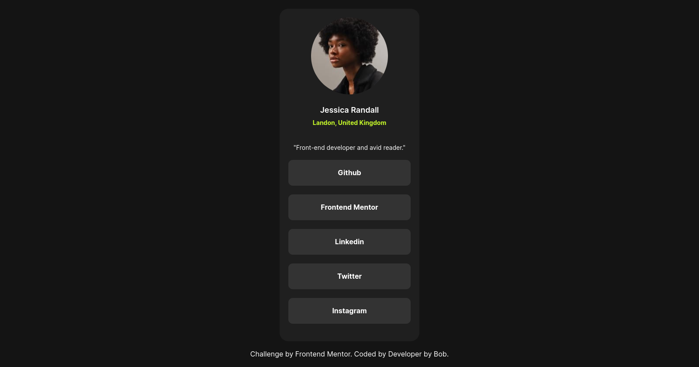
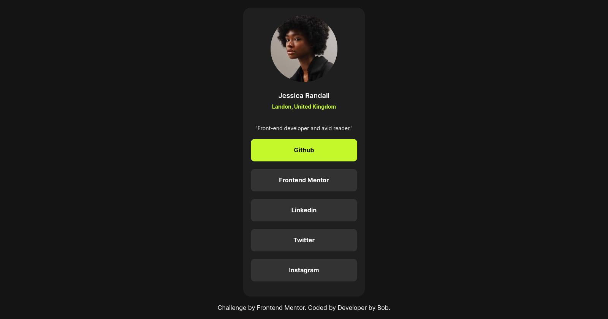

# Frontend Mentor - Social links profile solution

Esta é uma solução para o desafio [Social links profile challenge on Frontend Mentor](https://www.frontendmentor.io/challenges/social-links-profile-UG32l9m6dQ).

## Table of contents

- [Visão Geral](#visao-geral)
  - [O Desafio](#o-desafio)
  - [Screenshot](#screenshot)
  - [Links](#links)
  - [Construido Com](#construido-com)
- [Autor](#Autor)
- [Agradecimentos](#agradecimentos)

## Visão Geral

### O Desafio

Os usuários devem ser capazes de:

- Veja os estados de foco e foco para todos os elementos interativos na página

### Screenshot

### Links

- Solution URL: [https://github.com/developedbyBob/social-links-profile-main](https://github.com/developedbyBob/social-links-profile-main)
- Live Site URL: [Add live site URL here](https://your-live-site-url.com)

### Built with

- HTML5 Semântico
- CSS3
- Flexbox
- CSS Grid
- Mobile-first workflow

## Autor

- Website - [https://github.com/developedbyBob](https://github.com/developedbyBob)
- Frontend Mentor - [@devcabessa](https://www.frontendmentor.io/profile/devcabessa)